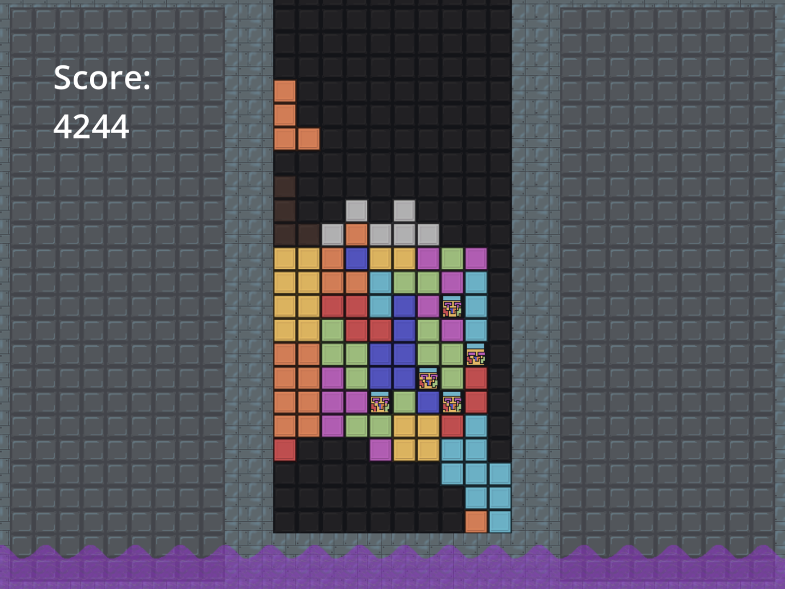
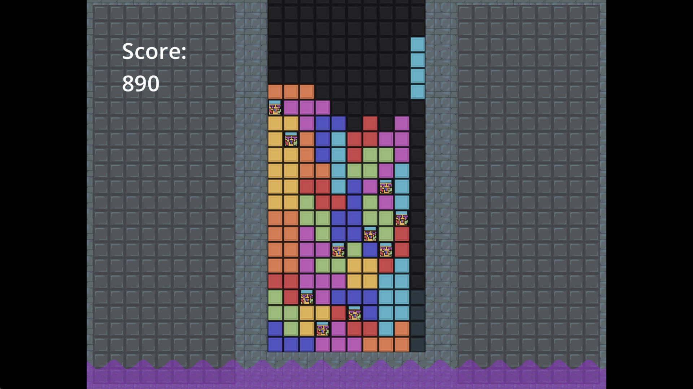
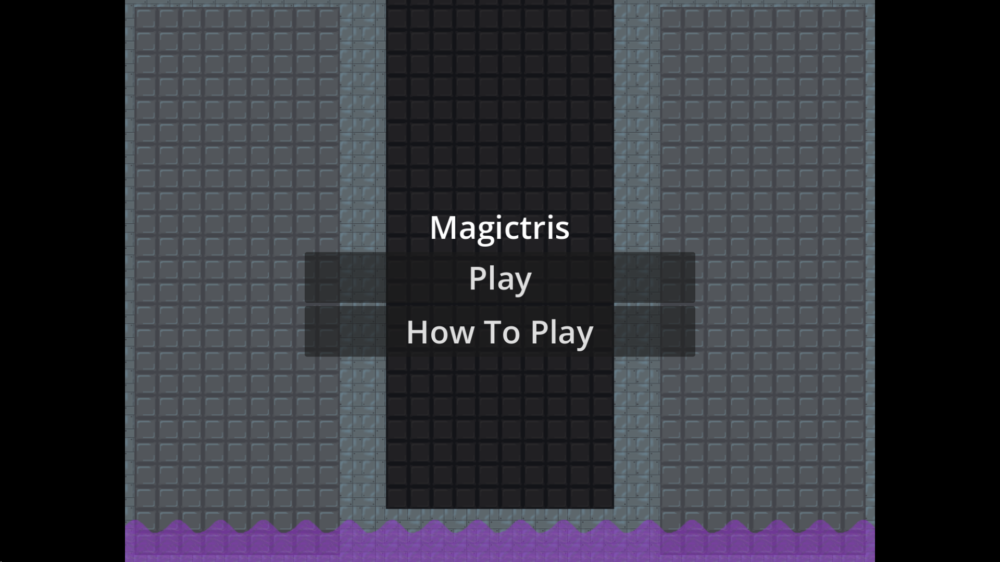

# Magictris

Somewhat accurate tetris clone with the added fun of magic blocks that can explode

## Features

- [Super Rotation System](https://tetris.wiki/Super_Rotation_System); more forgiving rotation
- [DAS](https://tetris.wiki/DAS); more intuitive horizontal control
- Magic blocks

## Twist: Magic blocks appear in each bag.

The magic blocks have special properties that change how you play.

- If you place two magic blocks adjacent, your next moves will all be the same type.
- If you fill a row that only has one magic block, the row will not clear and the block explodes
- If you fill a row with multiple magic blocks, the blocks will fill empty spaces around them as well.
- Both the fillings and explosions catalyse to magic blocks with their area of effect

## How To Play

- Tetris as normal
- Some tetrominos will have magic blocks inside them

## Controls

### WASD Controls

Move: A and D
Soft Drop: S
Hard Drop: Space or J
Rotate: W or K
Rotate Counter-clockwise: E or L
Hold: C

### Arrow Controls

Move: Left and right arrows
Hard Drop: Space
Soft Drop: Down arrow
Rotate: Up arrow
Rotate Counter-clockwise: X
Hold: C

## Screenshots

## AI Usage

Used ai to generate some data for rotating the pieces [commit db62e0af9857](https://github.com/Lochi-dot-JPEG/twistris/commit/db62e0af9857e85d85ceafc29fb4929e7bdb13e4). All art was made by hand

## Credits

Sound effects:

- [opengame art click sound](https://opengameart.org/content/click-ui-menu-sfx-yesnoselect)
- [explosion](https://freesound.org/people/unfa/sounds/609588/)
- [glass shatter (reversed in game)](https://freesound.org/people/matthewHoldenSound/sounds/542565/)
